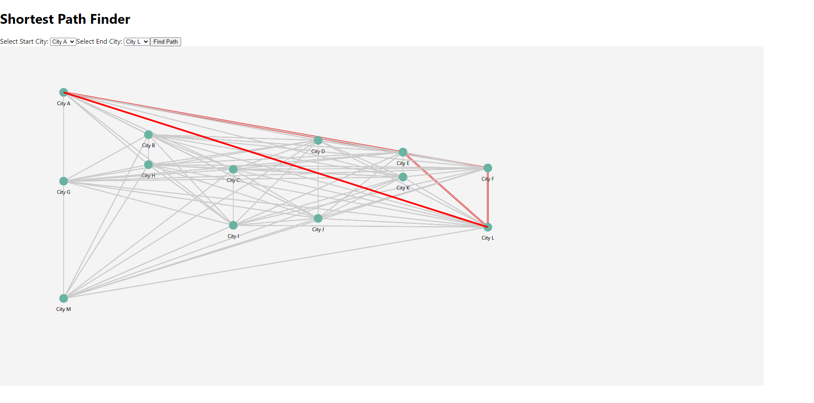

# Shortest Path Finder with Dijkstra Algorithm

This project demonstrates the visualization of a shortest path algorithm using Dijkstra's Algorithm. The user can select a start and end city from a randomly generated network of cities, and the application will calculate and visualize the shortest path between them.

## Features

- **Random City Network**: A network of cities connected by roads with random weights representing distances.
- **Interactive Map**: Users can select their starting and ending cities from a dropdown menu.
- **Dijkstra's Algorithm**: The shortest path is calculated using Dijkstra's algorithm and visualized on an interactive map.
- **City and Road Visualization**: Cities are displayed as circles, and roads (edges) are represented by lines connecting the cities.

## Screenshot



> The screenshot above shows the visualization of the shortest path between two cities.

## View it live

You can view the live demo of the application at: [Live Demo](https://dsa-project-omega.vercel.app/)

## Installation

1. **Clone the repository**:

   ```bash
   git clone https://github.com/Samiul-Islam-123/DSA-project.git
   cd DSA-project
   ```

2. **Install dependencies**:

   Make sure you have Node.js and npm installed. Then, run:

   ```bash
   npm install
   ```

3. **Start the development server**:

   After the dependencies are installed, you can start the app:

   ```bash
   npm start
   ```

   This will open the application in your browser. You can interact with the map, select a start and end city, and see the shortest path calculated and visualized.

## How It Works

1. **Graph Generation**:
   - A random graph of cities is created, with random distances (weights) between cities.
   - The cities are placed on an SVG canvas, and lines represent roads between them.

2. **Shortest Path Calculation**:
   - The Dijkstra algorithm is used to find the shortest path between two cities.
   - Once the user selects the start and end cities, the algorithm computes the path, and the result is displayed by highlighting the path in red.

3. **Interactive Interface**:
   - The user can select different cities for the start and end points using dropdown menus.
   - Clicking the "Find Path" button triggers the path calculation and updates the visualization.

## Technologies Used

- **React**: For building the user interface.
- **D3.js**: For visualizing the graph and paths on the canvas.
- **Dijkstra's Algorithm**: For calculating the shortest path between two cities.

## Team Members

1. Manisha Debnath(UG/02/BTCSE/2023/030)
2. Arijit De(UG/02/BTCSE/2023/038)
3. Satyajit Sasmal(UG/02/BTCSE/2023/002)
## Contributing

1. Fork this repository.
2. Create a new branch (`git checkout -b feature/your-feature`).
3. Make your changes.
4. Commit your changes (`git commit -am 'Add new feature'`).
5. Push to the branch (`git push origin feature/your-feature`).
6. Create a new pull request.

